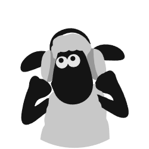

# ADN GDown

<div align="center">



**Faça scrape e baixe arquivos do GDrive de forma facilitada.**

Um aplicativo desktop poderoso e intuitivo para fazer scraping e baixar arquivos do Google Drive com suporte a links antigos e autenticação.

[Recursos](#recursos) • [Instalação](#instalação) • [Como Usar](#como-usar) • [Requisitos](#requisitos)

</div>

---

## Sobre

**ADN GDown** é uma solução completa para usuários que precisam fazer scraping e download de arquivos do Google Drive de forma facilitada. Com uma interface moderna e intuitiva, o aplicativo permite:

- Fazer scraping de pastas compartilhadas do Google Drive
- Baixar arquivos com suporte a links antigos
- Autenticação segura com Google
- Gerenciamento de downloads em fila
- Interface responsiva com tema claro/escuro

## Recursos

✨ **Interface Moderna**
- Design limpo e intuitivo com Python Tkinter
- Suporte a tema escuro e claro
- Reativo e responsivo

📥 **Download Avançado**
- Suporte a links antigos do Google Drive
- Fila de downloads inteligente
- Autenticação com Google OAuth 2.0
- Controle de downloads (pausa, retomada, cancelamento)

🔐 **Segurança**

Alguns arquivos antigos hospedados no Google Drive exigem que o usuário esteja logado para acesso, a autenticação OAuth diretamente no navegador virtual contorna este problema na maioria dos casos. 

Atenção! A Verificação OAuth é opcional e deve ser mantida desligada para a maioria dos casos, exceto se o arquivo apresentar bloqueio de Acess Denied.

- Autenticação OAuth 2.0
- Gerenciamento seguro de credenciais
- Suporte a verificação de autenticidade

🎯 **Funcionalidades**
- Scraping de sites com listas de arquivos.
- Seleção de pasta de destino
- Histórico de URLs
- Configuração persistente
- Relatórios de download

## Requisitos

- **Python 3.8+**
- **Windows, macOS ou Linux**
- Conexão ativa com internet
- Conta do Google (para scraping autenticado)

## Instalação

### 1. Clone ou Baixe o Repositório

```bash
git clone https://github.com/seu-usuario/adn-gdown.git
cd adn-gdown
```

### 2. Instale as Dependências

```bash
pip install -r requirements.txt
```

**Dependências principais:**
- `requests` - Requisições HTTP
- `beautifulsoup4` - Parse de HTML
- `selenium` - Automação de browser
- `webdriver-manager` - Gerenciamento de WebDriver
- `Pillow` - Processamento de imagens


## Como Usar

### Iniciando o Aplicativo

```bash
python app.py
```

Ou execute diretamente:

```bash
python downloader_gui.py
```

### Fluxo Básico

1. **Adicione URLs**: Cole as URLs do Google Drive que deseja fazer scraping
2. **Selecione Pasta de Destino**: Escolha onde os arquivos serão salvos
3. **Configure Autenticação**: Se necessário, faça login com sua conta do Google
4. **Inicie Download**: Clique em "Baixar" para começar
5. **Acompanhe Progresso**: Monitore o status de cada arquivo em tempo real

### Recursos Adicionais

- **Tema**: Alterne entre tema escuro e claro com o botão no canto superior direito
- **Histórico**: O aplicativo mantém histórico dos últimos URLs processados
- **Persistência**: Suas configurações são salvas automaticamente

## Estrutura do Projeto

```
adn-gdown/
├── app.py                    # Launcher principal
├── downloader_gui.py         # Interface gráfica
├── scraper.py               # Lógica de scraping
├── google_auth.py           # Autenticação Google
├── login_window.py          # Janela de login
├── requirements.txt         # Dependências Python
├── icon.png                 # Ícone da aplicação
├── icon.svg                 # Ícone vetorial
├── build_exe.bat           # Script para buildar executável
└── README.md               # Este arquivo
```

## Desenvolvimento

### Variáveis de Ambiente Úteis

```bash
# Para debug
DEBUG=True python app.py

# Para logs verbosos
VERBOSE=True python app.py
```

### Construindo Executável

Para criar um executável standalone do Windows:

```bash
python build_exe.bat
```

Ou manualmente:

```bash
pip install pyinstaller
pyinstaller downloader_gui.py --onefile --icon=icon.ico
```

## Contribuindo

Contribuições são bem-vindas! Por favor:

1. Faça um Fork do projeto
2. Crie uma branch para sua feature (`git checkout -b feature/AmazingFeature`)
3. Commit suas mudanças (`git commit -m 'Add some AmazingFeature'`)
4. Push para a branch (`git push origin feature/AmazingFeature`)
5. Abra um Pull Request

## Problemas Conhecidos

- Links muito antigos do Google Drive podem não funcionar
- Alguns navegadores podem bloquear downloads automáticos

## Licença

Este projeto é distribuído sob a licença MIT. Veja o arquivo `LICENSE` para mais detalhes.

## Suporte

Para reportar bugs ou sugerir melhorias, abra uma [Issue](https://github.com/SrThankyouADN/adn-gdown/issues).

---

<div align="center">

Feito com ❤️ para facilitar downloads do Google Drive

[⬆ Voltar ao Topo](#adn-gdown)

</div>
